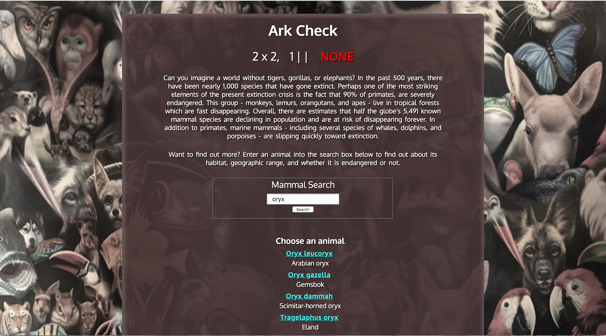
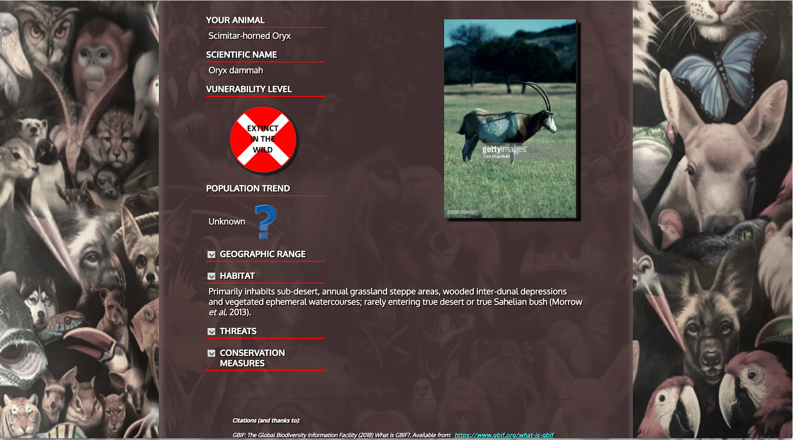

Ark Check

API Capstone Project for Thinkful

Live link: https://jules323.github.io/Ark-Check/

This application utilizes three source databases to search for the endangered status of mammals. The user may search by an animal's common name, scientific name, or by genus to see results of related mammals.

API calls:

	GBIF - Global Biodiversity Information Facility, uses search term to retrieve related common and scientific names.
	REDListData1 - International Union for Conservation of Nature and Natural Resources Red List API, retrieves narrative information pertaining to the chosen animal.
	REDListData2 - International Union for Conservation of Nature and Natural Resources Red List API, retrieves the vunerability catagory of the chosen animal.
	GettyPic - Getty Images - retrieves a photo of the chosen animal.

A citation section at the bottom of the page contains full citations and links to source materials.

Application screenshots:

